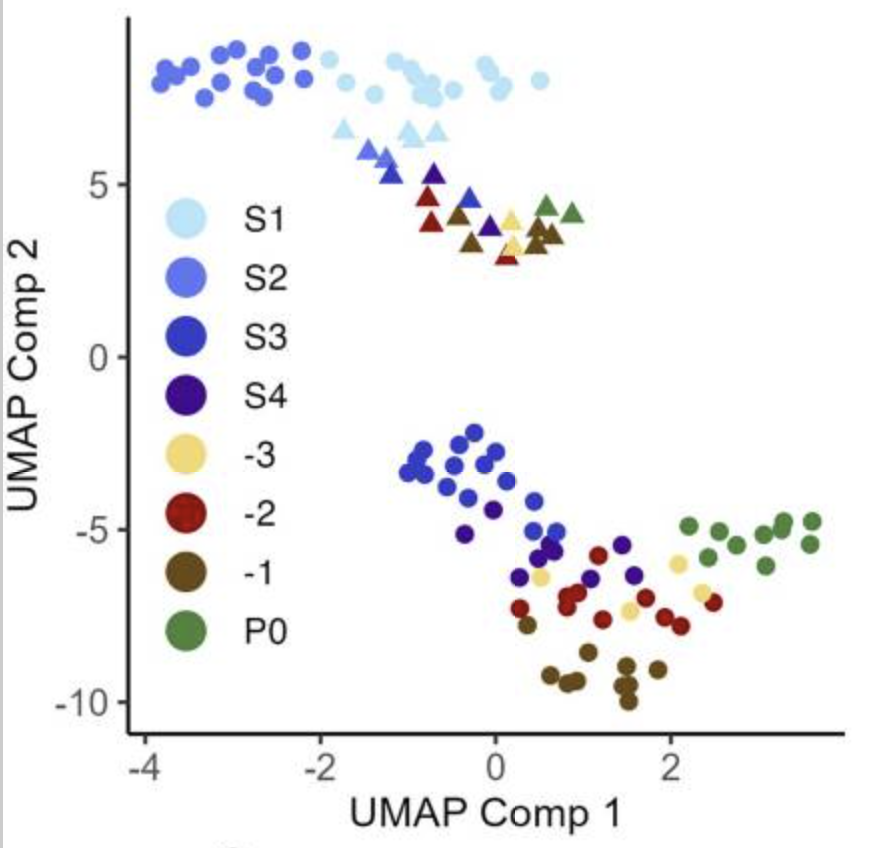

Emaan Kapadia and Rose Runyan's 2025 Quantitative Biology Lab Project

### Exploring the Differential Expression of Genes during Oogenesis in C. elegans

#### Description
We're basing our project from data collected in Su et al., 2024 frontiers, where they collected scRNA-seq data from differing segments of the C. elegans germline. We plan to start with the raw sequencing files, and go through the processing pipeline. Once processed, we would like to perform various scRNA-seq analyses, such as generating a UMAP, analyze differential experession, and then further analyze the unique genes and their function (through GO term analyses) for a region of interest. :heart:

Published figure from Su et al. \
 

Dataset ID: GSE261784 from Su et al. \
[Dataset Link](https://www.ncbi.nlm.nih.gov/sra?linkname=bioproject_sra_all&from_uid=1088873)

Software:
1. [Quality control with FASTQC version 0.12.1](https://www.bioinformatics.babraham.ac.uk/projects/fastqc/)
2. [Trimming off adaptor sequences with Cutadapt vsersion 5.2](https://cutadapt.readthedocs.io/en/stable/)
3. [Alignment done with HISAT2 version 2.2.1](https://daehwankimlab.github.io/hisat2/manual/) AND/OR Salmon version 1.10.3 
4. [Quality control with QoRTs version 1.3.6](https://hartleys.github.io/QoRTs/)
5. [RNA seq analysis with monocle3](https://github.com/cole-trapnell-lab/monocle3)
6. [GO term analysis with ClusterProfiler version 4.16.0](https://bioconductor.org/packages/release/bioc/html/clusterProfiler.html)

#### Goals
1. Create a UMAP that we expect will cluster based on the different cell types expressed along the gonad developmental axis.
2. Perform GO term analysis to determine the roles of the genes in each developmental segment
3. Isolate a group of genes of interest and create a heatmap for each one that shows its differential expression across the developmental axis.
